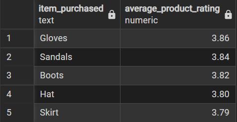
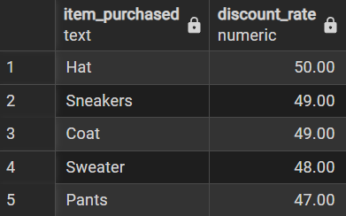
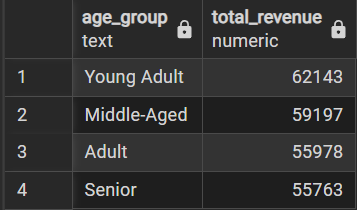
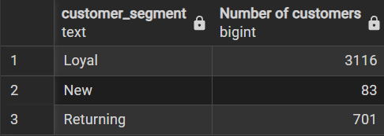
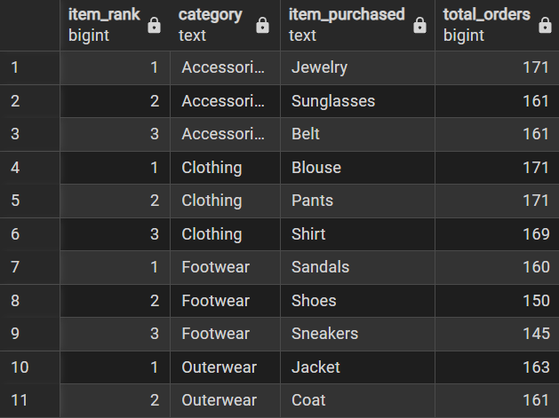

# 🛍️ Customer Shopping Behavior Analysis
##  Overview
This project analyzes customer shopping behavior using a real-world retail dataset. The goal is to uncover meaningful patterns in purchasing habits, discount usage, product popularity, subscription behavior, and revenue distribution across different customer segments.
The analysis was carried out using Python for data preparation, PostgreSQL for structured querying, and Power BI for interactive dashboard visualization.

SQL queries? Check them here[SQL_queries](/queries.sql)

## 📈 Dashboard Preview


## 🛠️ Tools & Technologies Used

| Tool | Purpose |
|------|---------|
| Python (Pandas, SQLAlchemy) | Data cleaning, transformation, and loading |
| PostgreSQL (pgAdmin) | Database storage and SQL analysis |
| Power BI | Interactive dashboard and data visualization |
| VS Code | Development environment |
| Git & GitHub | Version control and project hosting |

## 📊 Analysis

### 🟢 Basic Queries

---

#### Q1. What is the total revenue generated by male vs. female customers?
> **Result:** Male customers generated **$157890** in total revenue while female customers generated **$75191**, making males the higher spending segment.

---

#### Q4. Compare the average purchase amount between Standard and Express shipping.
> **Result:** Standard shipping had an average purchase amount of **$58.46** compared to Express shipping at **$60.48**, showing nearly identical spending regardless of shipping choice.

---

#### Q5. Do subscribed customers spend more?
> **Result:** Subscribed customers (**1053** total) generated **$62645.00** in revenue with an average spend of **$59.49**, compared to non-subscribed customers (**2847** total) generating **$170436.00** at **$59.87** average.

---

#### Q9. Are repeat buyers more likely to be subscribers?
> **Result:** Out of customers with more than 5 previous purchases, **958** were subscribed and **2518** were not, showing subscribed customers are more likely to be repeat buyers.

### 🟡 Intermediate Queries

---

#### Q2. Which customers used a discount but still spent more than the average purchase amount?

> **Result:** **839** customers used a discount and still spent above the average purchase amount, indicating a strong high-value discount user segment.

---

#### Q3. Which are the top 5 products with the highest average review ratings?

> **Result:** **Gloves** ranked highest with a **3.86** average rating, followed by **Sandals (3.84)**, **Boots (3.82)**, **Hat (3.80)**, and **Skirt (3.79)**.



---

#### Q6. Which 5 products have the highest percentage of purchases with a discount applied?

> **Result:** **Hat** had the highest discount rate at **50%**, followed by **Sneakers (49%)**, **Coat (49%)**, **Sweater (48%)**, and **Pants (47%)**.



---

#### Q10. What is the revenue contribution by age group?

> **Result:** **Young Adults** contributed the highest revenue at **$62,143**, followed by **Middle-Aged ($59,197)**, **Adult ($55,978)**, and **Senior ($55,763)**.



### 🔴 Advanced Queries

---

#### Q7. Segment customers into New, Returning, and Loyal based on previous purchases.
**Concepts used:** CTE + CASE Statement
```sql
WITH customer_type AS (
    SELECT customer_id, previous_purchases,
           CASE
               WHEN previous_purchases = 1 THEN 'New'
               WHEN previous_purchases BETWEEN 2 AND 10 THEN 'Returning'
               ELSE 'Loyal'
           END AS customer_segment
    FROM customer
)
SELECT customer_segment, COUNT(*) AS "Number of customers"
FROM customer_type
GROUP BY customer_segment;
```
> **Result:** The majority of customers are **Loyal (3,116)**, followed by **Returning (701)** and **New (83)**, indicating a strong base of repeat customers.



---

#### Q8. What are the top 3 most purchased products within each category?
**Concepts used:** CTE + Window Function (ROW_NUMBER + PARTITION BY)
```sql
WITH item_count AS (
    SELECT category, item_purchased,
           COUNT(customer_id) AS total_orders,
           ROW_NUMBER() OVER (PARTITION BY category ORDER BY COUNT(customer_id) DESC) AS item_rank
    FROM customer
    GROUP BY category, item_purchased
)
SELECT item_rank, category, item_purchased, total_orders
FROM item_count
WHERE item_rank <= 3;
```
> **Result:** Top products per category — **Accessories:** Jewelry (171), Sunglasses (161), Belt (161) | **Clothing:** Blouse (171), Pants (171), Shirt (169) | **Footwear:** Sandals (160), Shoes (150), Sneakers (145) | **Outerwear:** Jacket (163), Coat (161).



## 💡 What I Learned

### 🐍 Python & Data Preparation
- How to clean and transform raw data using **Pandas** before loading it into a database.
- Learned the importance of **lowercasing and renaming column names** before uploading to PostgreSQL to avoid case-sensitivity errors.
- Understood how **SQLAlchemy** acts as a bridge between Python and PostgreSQL using connection strings.
- Learned that all data transformations must be done **before** calling `df.to_sql()`, and using `if_exists="replace"` ensures the old table is always overwritten cleanly.

---

### 🗄️ PostgreSQL & SQL
- Understood how **PostgreSQL handles column names** differently — unquoted names are converted to lowercase, so column names must match exactly.
- Learned to write and debug **subqueries** to compare individual rows against aggregate values like AVG.
- Used **CTEs (Common Table Expressions)** with `WITH` clause to break complex queries into readable steps.
- Applied **Window Functions** like `ROW_NUMBER() OVER (PARTITION BY ...)` to rank items within groups without collapsing rows.
- Learned that **integer division** in SQL always returns 0 for decimals — using `100.0` instead of `100` forces float division for accurate percentages.
- Understood why **string comparisons are case-sensitive** in SQL — `'yes'` and `'Yes'` are treated as completely different values.

---

### 🐛 Debugging & Problem Solving
- Diagnosed and fixed real errors like:
  - `column does not exist` → caused by missing `FROM` clause or case mismatch
  - `password authentication failed` → wrong credentials in connection string
  - `syntax error at or near FROM` → `FROM` accidentally placed inside `AVG()`
  - `discount_rate returning 0.00` → caused by lowercase `'yes'` not matching `'Yes'` in data
- Learned that **misleading error messages** in PostgreSQL often point to a different root cause than what is shown.

---

### 📊 Data Visualization
- Connected **PostgreSQL directly to Power BI** to build live interactive dashboards.
- Translated raw SQL query results into meaningful **charts and visuals** to tell a data story.

---

### 🗂️ Project Management & GitHub
- Learned how to structure a **complete end-to-end data project** with organized folders for data, notebooks, SQL, and dashboards.
- Used **Git and VS Code** to version control and publish the project to GitHub.
- Understood the importance of a well-written **README** to present a project professionally for a portfolio.

## ✅ Conclusion

This project delivered a complete end-to-end data analytics workflow — from raw CSV data 
to SQL analysis and a Power BI dashboard — uncovering the following key business insights:

---

### 👥 Customer Behavior
- The customer base is predominantly **Loyal (3,116 customers)**, with a smaller 
  pool of **Returning (701)** and **New (83)** customers, suggesting strong 
  retention but a need to focus on acquiring new customers.
- Customers with **more than 5 previous purchases** are more likely to be 
  **subscribed**, confirming that loyalty and subscription go hand in hand.

---

### 💰 Revenue Insights
- **Young Adults** are the highest revenue-generating age group at **$62,143**, 
  followed closely by **Middle-Aged ($59,197)**, **Adult ($55,978)**, 
  and **Senior ($55,763)** — showing fairly balanced spending across all age groups.
- **800+ customers** used a discount yet still spent above the average purchase 
  amount, proving that discounts do not always reduce overall spending and can 
  attract high-value buyers.

---

### 🛍️ Product & Category Performance
- **Gloves** ranked as the highest rated product **(3.86)**, indicating strong 
  customer satisfaction in accessories.
- In every category, the top products were closely contested —  
  **Jewelry & Blouse (171 orders)** led Accessories and Clothing respectively, 
  showing balanced product demand within categories.
- **Hat** had the highest discount application rate at **50%**, meaning half of 
  all Hat purchases involved a discount — useful insight for pricing strategy.

---

### 🚚 Shipping & Subscription
- **Standard and Express shipping** showed nearly identical average purchase 
  amounts, suggesting shipping type does not significantly influence 
  how much a customer spends.
- **Subscribed customers** show higher total revenue contribution, making the 
  subscription program a valuable channel for driving consistent sales.

---

### 🎯 Final Takeaway
This analysis proves that data-driven decisions can directly impact business 
strategy — from targeting high-value discount users, to focusing retention 
efforts on the loyal customer segment, to optimizing product promotions by 
category. The combination of **Python, SQL, and Power BI** provided a powerful 
toolkit to extract, analyze, and communicate these insights effectively.